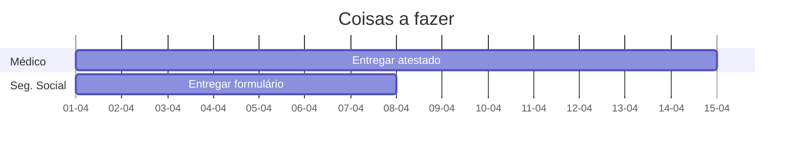
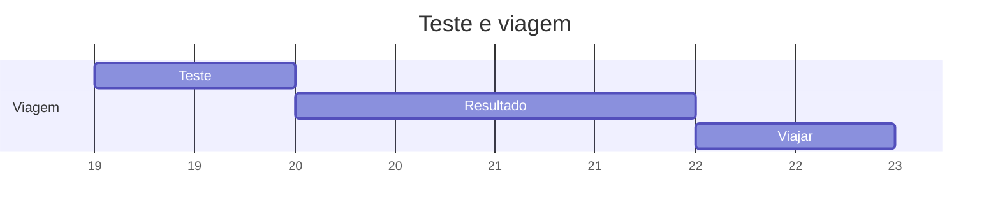

# Antes de ir

Arranjar todos os documentos:
- [X] Cartão de saude europeu
- [X] Carta de condução
- [X] Cartão de cidadão
- [x] Papel IBAN do banco
- [x] Cópias cartão de cidadão
- [x] Contrato para poder sair de portugal
- [x] Certidão de nascimento

**Coisas a fazer**
- [X] Ir à caixa agrícola perguntar sobre conta de banco lá
	- Não há maneira. Tenho mesmo de tratar com um banco de lá.
- [x] Comprar medicamentos farmácia
	- [x] Valdispert
	- [x] Comprimidos para dormir
	- [x] Paracetamol
	- [x] Faktu
	- [x] Daflon
	- [x] Bepantene
- [x] Marcar médico
	- [ ] Quinta feira, dia 15, às 17:00
- [x] Comprar voo
	- [x] 22 Março
	- [ ] 26 Março
- [ ] Preencher formulário de saida do país
	- [x] https://www.interieur.gouv.fr/content/download/126150/1008802/file/04-02-2021-engagement-sur-l-honneur-plus-de-11-ans-version-anglaise.docx
	- [ ] https://portaldascomunidades.mne.gov.pt/pt/vai-viajar/registo-do-viajante
- [x] Marcar Teste PCR (72 horas antes)

	```
	Algarve - Hospitais de Alvor
	2ªs, 4ªs e 6ªs feiras, entre as 8H e as 10H,  resultado em 48Horas.
	282 420 400
	```

	```
	AQUALAB
	Portimão – 282 424 250
	clinica.jjc@aqualab.pt
	resultado 24/48 horas
	```



# Logo que chegar

- [x] Arranjar casa
	- [x] Copia do contrato
	- [x] Copia cartão de cidadão
	- [x] Pedir certidão de morada
- [ ] Ir ao médico
	- **Jeudi 15, 17h**
	- Docteur Jean-François DOSSAT
		82, rue Matabiau
		31 000 TOULOUSE
		05 61 62 25 65
- [ ] Arranjar conta bancária
	- [x] Cartão cidadão
	- [x] Prova de morada em Toulouse
	- [x] Certidão de nascimento (?)
	- ~~Bousourama~~ não dá. Pede RIB
	- **Hello bank** -> Acho que vai ser este. Versão 0€/mes
	- ING; Atestado de residencia especifico; Telemovel francês
	- ~~Orange bank~~; reddit NO NO
	- Ma French Bank; 2€/mes; RIB!! (EU?)
- [x] Ir à segurança social
	-   CPAM de la Haute-Garonne | Agence Toulouse centre
		3 Boulevard du Professeur Léopold Escande
		31000 TOULOUSE
	- [x] Cópia cartão cidadão
	- [x] Contrato de trabalho
	- [x] Prova de morada em Toulouse
	- [x] Informação IBAN (preferencialmente francês)
	- [x] Certidão de Nascimento
- [x] Arranjar cartão de telefone
	- https://www.bouyguestelecom.fr/forfaits-mobiles/sans-engagement
	- https://m.shop.sosh.fr/mobile/forfait-bon-plan-promo-v-70go-10go?MCO=SOH
	- Numero: 06 20 77 26 42
	- PIN: 2780
	- PUK: 13299810
- [x] Tratar de apoio à habitação
	- Se não for contrato individual não dá para pedir apoio!


# A seu tempo
- [x] Arranjar cartão de metro
	- [x] Utilizar telemovel
- [x] Arranjar cartão das bicicletas
	- Pedir o cartão express (na câmara)
	- codigo: 1290

# Numeros informaçao