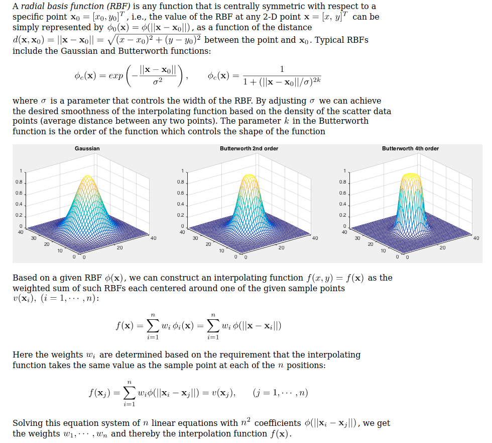
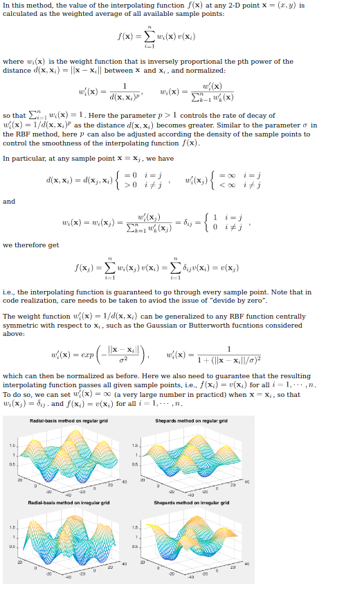

# Bibliography to read

- [ ] W. THOLLET, F. BLANC, G. DUFOUR& X. CARBONNEAU. Body force modeling for aerodynamic analysis of air intake-faninteractions.3AF Conference, 2015.
    
- [ ] Y. GONG. A computational model for rotating stall and inlet distortions in multistage compressors.PhD thesis, MassachusettsInstitute of Technology, 1999.
    
- [ ] Benichou, Emmanuel and Dufour, Guillaume and Bousquet, Yannick and Binder, Nicolas and Ortolan, Aurélie andCarbonneau, Xavier Body force modeling of the aerodynamics of a low-speed fan under distorted inflow. (2019) In:13th European Turbomachinery Conference, 8 April 2019 - 12 April 2019 (Lausanne, Switzerland).
    
- [ ] López de Vega, Antonio and Dufour, Guillaume and Blanc, Florian and Thollet, William A Machine Learning BasedBody Force Model for Analysis of Fan-Airframe Aerodynamic Interactions. (2018) In: Global Power and PropulsionSociety Conference 2018, 7 May 2018 - 9 May 2018 (Montréal, Canada).
    
- [ ] Body force modeling of fan-airframe interactions, PhD Thesis
    

# Benefits of BFM

1.  Reduced computational cost, due to the lack of near wall meshing on the blades.
2.  The effect of the blades on the flow is redistributed in the tangential direction, allowing to handle cases with distortion with steady computations. Discrete blades would require unsteady computations to capture the wakes.
3.  Unlike the actuator disk method, the source terms are active in the whole volume swept by the blades, allowing the capture of effects occurring within the blade row, such as mass flow distribution.

# General procedure:

## Quasi-steady assumption

The flow field is assumed to be quasi steady in the blade row frame of reference. This implies that circumferential perturbations have a long time-scale when compared to the aerodynamic through flow time. This is acceptable for distortions due to BLI or short intakes.

The quasi-steady assumption results in a filtering of stator-rotor interactions.

A reduced frequency $f$ is defined as

$$
f = \frac{2 \pi r \Omega c}{\lambda V_x}, 
$$

comparing the time scale associated with the unsteadiness due to distortion $\frac{\lambda}{2 \pi r \Omega}$ and the time scale associated to the convection through a blade row $\frac{c}{V_x}$.

The quasi-steady assumption is only valid for $f < 1$ (time scale of unsteadiness due to distortion larger than time scale associated to the convection)

## Equations of motion

# Hall's Model

## Modification by William Thollet

# Interpolation of variables

the blockage term, as well as its gratient and other variables must be interpolated to the cell center location. In Star-CCM+ this interpolation is performed with nearest-neighbour interpolation.

There should be a better way to do this. My thinking is a user code library that performs bilinear*/other interpolation on a given table. The library should be compiled for each table.

**Data is assumed not to be in a uniform grid**, therefore specific methods have to be applied, for example:

(http://fourier.eng.hmc.edu/e176/lectures/ch7/node7.html)

### Radial Basis Functions

### Sheperd's method (inverse distance weight)
