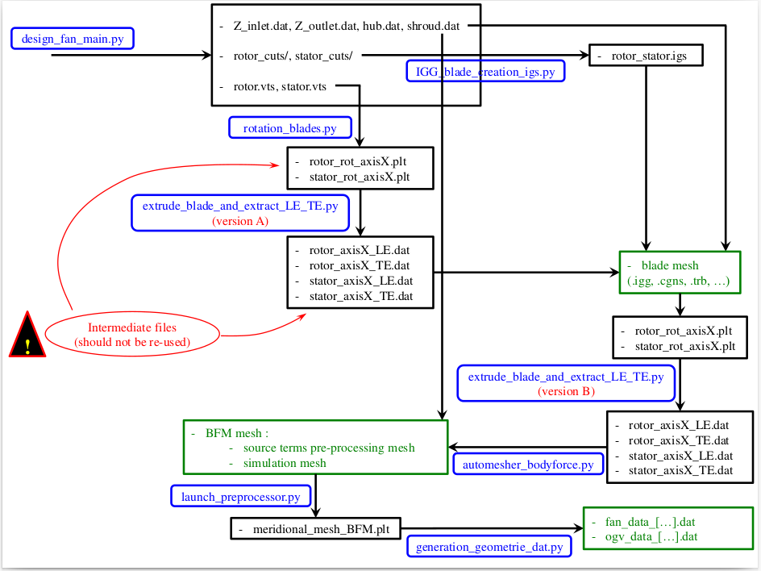
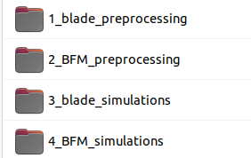

The following procedure is redundant and somehow not efficient. However it leads with certainty to success in numerical pre-processing. Thus, it has been voluntarily kept as it is (actually, the different steps and their order is the result of the different bugs which have been observed and can be seen as the current "best practice"). It is by far perfectible !

# 0/ NECESSARY INPUTS

From the fan design outputs, copy the following files / repositories:
 - rotor.vts
 - stator.vts
 - hub.dat
 - shroud.dat
 - Z_inlet.dat
 - Z_outlet.dat
 - rotor_cuts/
 - stator_cuts/


# 1/ PREPROCESSING FOR BLADE SIMULATIONS

## 1/1. Execute *rotation_blades.py*
This script creates two files : *rotor_rot_axisX.plt* and *stator_rot_axisX.plt*.
The blades from *rotor.vts* and *stator.vts* are read, turned 45 degrees around the engine axis (X axis, here) to avoid any singularity afterwards (2 pi discontinuity when dealing with arctan function, namely) and re-written in binary Tecplot format.

## 1/2. Execute extrude_blade_and_extract_LE_TE.py     ! version A !
This script reads rotor_rot_axisX.plt and stator_rot_axisX.plt (the names are specified in preprocess_parameters.py, l. 25)
and extracts the LE and TE of both rows : rotor_axisX_LE.dat, rotor_axisX_TE.dat, stator_axisX_LE.dat, stator_axisX_TE.dat (the names are specified in preprocess_parameters.py, l. 19)

## 1/3. In IGG (version > 10.2), execute IGG_blade_creation_igs.py
!!! The path l. 10 must be an absolute path : path = "./" will not work !!!
This script creates a lofted surface from hub to tip, splitting section sides (SS) and pressure sides (PS) of the blades
(this practice seems to be more reliable with IGG Autogrid in the next step). The output is the rotor_stator.igs file.

## 1/4. In IGG Autogrid, the 3D mesh for blade simulations is finally created:
 - Open "Import and Link CAD"
 - Load the meridional curves (Z_inlet, Z_outlet, hub, shroud, rotor LE, rotor TE, stator LE, stator TE)
 - Link them to the corresponding parts (right click)
 - Load the rotor_stator.igs file (can take some time)
 - Link the 4 surfaces to the corresponding parts (rotor PS, rotor SS, stator PS, stator SS)
 - Finish the 3D mesh as usual (meridional streamlines, blade-to-blade cuts, 3D mesh), ensuring classical mesh criteria
The 3D mesh for this domain (single-passage for both rows) should be comprised of between 3 million and 5 million cells, depending on the geometry, and including a tip gap correctly discretized for the rotor.

!! Don't forget to tick both options "Blend the Blade At LE" and "Blend the Blade At TE" in B2B Topoplogy for both rows !!

Save the .trb file : you are ready to launch single-passage steady RANS simulations with FineTurbo to establish reference data for your fan performance !


# 2/ PREPROCESSING FOR BODY FORCE SIMULATIONS


## 2/1. Open in IGG the 3D blade mesh, and keep only the two blade O-blocks by deleting all the others.
Turn them so that the engine axis is the X axis and save these blocks as blade_skins.igg

## 2/2. In Tecplot, open blade_skins.cgns. Extract the blade skins for both rows by creating sub-zones and keeping the right surface
(i = imin for example). Save these blade geometries as tecplot files as rotor_rot_axisX.plt and stator_rot_axisX.plt

## 2/3. Execute extrude_blade_and_extract_LE_TE.py     ! version B !
This script reads **rotor_rot_axisX.plt** and **stator_rot_axisX.plt** (the names are specified in **preprocess_parameters.py**, l. 25) and extracts the LE and TE of both rows : **rotor_axisX_LE.dat**, **rotor_axisX_TE.dat**, **stator_axisX_LE.dat**, **stator_axisX_TE.dat** (the names are specified in **preprocess_parameters.py**, l. 19)
In these files, suppress the extension ".dat" in the file title (l. 1), for the next step in IGG (the names of the curves to call are defined in **automesh_parameters.py**, l. 12)

## 2/4. Open in IGG the necessary meridional curves (inlet, outlet, hub, shroud, LE and TE of both rows).
Save the project as **template.igg**

## 2/5. Create the BFM mesh with automesh_parameters.py and automesher_bodyforce.py by executing automesher_bodyforce.py.
The parameters (mainly the size of the cells at the ends of the segments and the number of points) must be adapted according to the geometry, allowing for a correct 2D mesh refinement of rotor and stator LE and TE.
The first cell size at hub / shroud should be identical to the one in the blade mesh, to ensure comparable boundary layer treatment.
For a 5 degrees angular sector with 4 cells in the azimuthal direction, the 3D BFM mesh should remain below 200.000 cells if possible. 
(During this process, in order to work faster, the creation of the 3D mesh can be deactivated, so that the user tries different parameters with the 2D BFM mesh. When a satisfactory 2D mesh is obtained, the 3D BFM mesh can be extruded from the 2D one.)

## 2/6. Open in Tecplot the 3D BFM mesh mesh_3D_imothep.cgns and convert it to a Tecplot format, save it as mesh_3D_imothep.plt.

## 2/7. The main body force pre-processing from William Thollet is ready to be used : with "python launch_preprocessor.py"
Two zones should be detected, "Block_2" and "Block_4", corresponding to the rotor and the stator, respectively. This step can take some time.
The output is the 2D Tecplot file **meridional_mesh_BFM.plt** which contains all the quantities needed in the source term modeling. Open it in Tecplot and check that the BFM pre-processing has been successful.

## 2/8. Execute generation_geometrie_dat.py in order to generate the tables to import into FineOpen.
These tables will be interpolated by the solver in order to calculate the source terms with the Hall-Thollet modeling.

## 2/9. In order to be imported and used in FineOpen, the body force mesh generated in 2/5. must be modified.
Open in IGG mesh_3D_imothep.igg and then:
 - rotate it so that the engine axis becomes the Z axis
 - add all the correct boundary conditions: periodic (PER) at the azimuthal boundaries, solid at the endwalls (SOL),
 inlet (INL) and outlet (OUT)
 - split the blocks 1, 3 and 5 in order to add the extra-cells neighboring the LE and the TE of the blades
 - impose rotor-stator (ROT) boundary conditions at the interfaces between blocks, so that FineOpen will not merge them when
 this igg mesh is imported
Save this mesh as mesh_calcul_template.igg for example.

You are ready to launch BFM RANS simulations with FineOpen and play the great calibration game !


## WARNINGS AND EXPLANATIONS

* All the previous steps are illustrated in BFM_preprocessing.pdf : in black, the files / repositories, in blue the scripts to
execute and in green the key outputs.

* !!! Beware that the output blade files from design_fan_main (rotor.vts and stator.vts) are not created in a cylindrical frame !!!
The 2D blade profiles are simply stacked, considering axis Z as the radial direction. Except for very small radii, there is
no visible difference. However, these files should not be considered as the final fan stage CAD !

* For that reason, IGG is needed to create the "real" CAD file rotor_stator.igs. This file is used to create the blade mesh, which
in turn is used to create the body force mesh.
Previous attempts were made to create a body force domain directly from rotor.vts and stator.vts but the BFM pre-processing step
encountered some difficulties then. More specifically, special attention should be paid for LE and TE definition : it would be possible
to write these files from the LE and TE meridional coordinates at the end of design_fan_main.py but this choice has proven to
be unsuccessful.
The files [blade]_axisX_LE.dat and [blade]_axisX_TE.dat must exactly correspond to the 3D blades which feed the BFM pre-processing.

* The mesh BFM refinement at the blades LE/TE and their intersections with the hub/shroud endwalls are two critical points.
Experience has shown that the BFM pre-processing is quite sensitive, so that it is safer to always take the blade mesh from Autogrid as reference instead of the direct output from the fan design. Moreover, it includes the refinement near the endwalls for boundary layers.

## SUMMARY OF THE PROCEDURE :

                    hub / shroud meridional curves     first extraction of LE / TE                second extraction of LE / TE
Fan stage design => rotor / stator 2D cuts          => in IGG, creation of rotor_stator.igs    => in IGG, creation of the BFM mesh
                    rotor.vts and stator.vts           in Autogrid, creation of the blade mesh    BFM pre-processing

* !!! Beware the difference between the two versions of extrude_blade_and_extract_LE_TE.py !!!
The difference lies in the indices manipulation l. 32-33 and 36-37. This is inherited from all the tests done and changes in space orientation (axis X / axis Z, (i,j,k) trihedron...) and could probably be easily solved / unified.

* A modification in Antares is necessary : it concerns the vtk_to_instant function in antares/utils/VtkUtilities.py
Here is the modification in the function used to convert structured grid VTK objects to Antares instant objects :

```python
def vtk_structuredgrid_to_instant(polydata, coordinates, instant, with_grid):
    """
    Convert a vtkStructuredGrid into an Instant.

    :param polydata: vtk object
    :type polydata: vtk.vtkStructuredGrid
    :param coordinates: name of coordinates
    :type coordinates: list of str
    :param instant: instant to fill
    :type instant: :ref:`instant`
    """
    from vtk.util import numpy_support

    nb_cells = polydata.GetNumberOfCells()
    if nb_cells > 0:
        dimensions = polydata.GetDimensions()
        instant_shape = tuple(dimensions)
        if with_grid:
            if polydata.GetClassName() == 'vtkImageData':
            #if polydata.GetClassName() in ['vtkImageData', 'vtkStructuredGrid']:	# marche pas
                origin = polydata.GetOrigin()		# pas dispo pour vtkStructuredGrid
                bounds = polydata.GetBounds()
                X = np.linspace(origin[0], bounds[1], dimensions[0])
                Y = np.linspace(origin[1], bounds[3], dimensions[1])
                Z = np.linspace(origin[2], bounds[5], dimensions[2])
                x, y, z = np.meshgrid(X, Y, Z, indexing='ij')
                instant['x'] = x.reshape(instant_shape)
                instant['y'] = y.reshape(instant_shape)
                instant['z'] = z.reshape(instant_shape)
                #------------ manu 05/2018 -----------------
            if polydata.GetClassName() == 'vtkStructuredGrid':
                coords = numpy_support.vtk_to_numpy(polydata.GetPoints().GetData())
                ### a recoder en plus propre et en plus efficace (sans boucle)
                ### il faut changer l'empilage (i,j,k) -> (k,j,i)
                instant['x'] = np.zeros((instant_shape[0], instant_shape[1], instant_shape[2]))
                instant['y'] = np.zeros((instant_shape[0], instant_shape[1], instant_shape[2]))
                instant['z'] = np.zeros((instant_shape[0], instant_shape[1], instant_shape[2]))
                coord_names = ['x', 'y', 'z']
                for num in range(len(coord_names)):
                    for ni in range(instant_shape[0]):
                        for nj in range(instant_shape[1]):
                            for nk in range(instant_shape[2]):
                                instant[coord_names[num]][ni, nj, nk] = coords[:,num][ni + instant_shape[0] * nj + instant_shape[0] * instant_shape[1] * nk]
                #------------ manu 05/2018 -----------------
                
        pointdata = polydata.GetPointData()
        for array_idx in range(pointdata.GetNumberOfArrays()):
            array_name = pointdata.GetArrayName(array_idx)
            array_data = \
                numpy_support.vtk_to_numpy(pointdata.GetArray(array_idx))
            if len(array_data.shape) == 1:
                instant[(array_name, 'node')] = array_data.reshape(instant_shape[::-1]).transpose()
            else:
                for coor_idx in range(array_data.shape[1]):
                    instant[('%s_%s' % (array_name,
                                        coordinates[coor_idx]),
                            'node')] = array_data[:, coor_idx].reshape(instant_shape[::-1]).transpose()

        celldata = polydata.GetCellData()
        for array_idx in range(celldata.GetNumberOfArrays()):
            array_name = celldata.GetArrayName(array_idx)
            array_data = \
                numpy_support.vtk_to_numpy(celldata.GetArray(array_idx))
            if len(array_data.shape) == 1:
                #------------ manu 07/2018 -----------------
                #instant[(array_name, 'cell')] = array_data.reshape(instant_shape[::-1]).transpose()
                if polydata.GetDimensions()[2] == 1:
                    instant[(array_name, 'cell')] = array_data.reshape((1, instant_shape[1]-1, instant_shape[0]-1)).transpose()
                else:
                    instant[(array_name, 'cell')] = array_data.reshape((instant_shape[2]-1, instant_shape[1]-1, instant_shape[0]-1)).transpose()
                #------------ manu 07/2018 -----------------
            else:
                for coor_idx in range(array_data.shape[1]):
                    instant[('%s_%s' % (array_name,
                                        coordinates[coor_idx]),
                            'cell')] = array_data[:, coor_idx].reshape(instant_shape[::-1]).transpose()

        return instant
    else:
        return None
```


* The BFM pre-processing also works directly with the axis Z as engine axis (it has been tested and validated). But elaborating the whole procedure, it just appeared simpler to keep the engine axis as X axis, and punctually rotate the domain when creating the BFM simulation mesh.

* Note that here, except for the axis orientation and block splitting, the BFM pre-processing mesh and the BFM simulation mesh are identical. It could be possible to pre-process the source terms geometric inputs on a different (coarser) mesh, without boundary layers at hub/shroud for example, and keep a fine mesh only for simulations. This has not been tested. The interpolation in FineOpen Euranus solver was thought to be simpler if the coordinates of imported .dat tables and mesh cells were the same, but apparently, it does not save any CPU cost...

* Another script exists to generate the source terms tables for StarCCM+ (see with Vincent Maillet) but it is not involved here.


