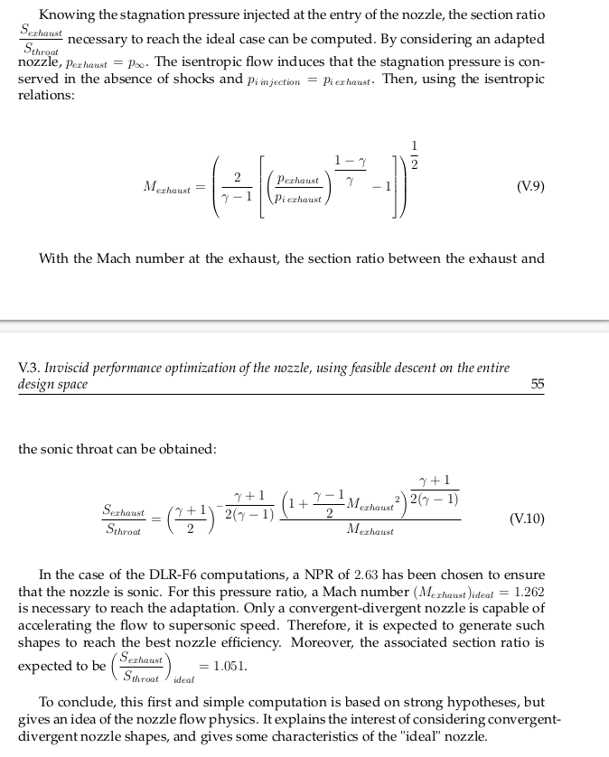

From: "Design and optimization of aircraft engine nozzles in under-wing configuration by Simon Bagy"

We want
- Monotonicaly convergent nozzle
- Adapted nozzle

The nozzle is considered to be adapted, meaning that $p_{9} = p_{\text{inf}}$. 