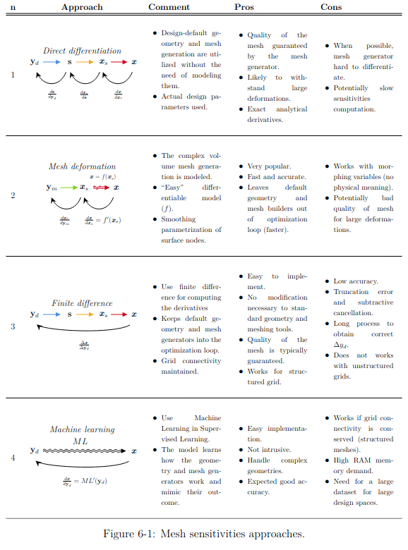

# Surrogate-based optimization
- Use dakota vs use SMT

# Mesh sensitivity
(from *Implementation and Evaluation of Machine Learning Assisted Adjoint Sensitivities Applied toTurbomachinery Design Optimization* by Matteo Ugolotti)
