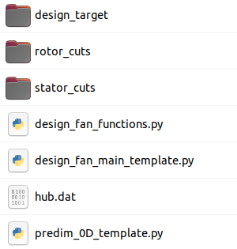

# predim_0D.py :

## INPUTS :
 - **Fan specifications** : 
 	- pressure ratio, 
 	- efficiency, 
 	- axial Mach number, 
 	- maximal relative tip Mach number, 
 	- hub / tip diameters
 - **Flight conditions** : 
 	- flight Mach number, 
 	- static temperature, 
 	- static pressure

## OUTPUTS :
 - maximal rotational speed allowed
 - massflow rate
 - some bonus indications : 
 	- power estimation, 
 	- thrust estimation, 
 	- meanline turning angle for the rotor

## Comments
In step 2/, it is possible to take a "security margin" for the supersonic flow character in the rotor tip region:
- by drawing a velocity triangle at the tip (l. 82) with a higher axial velocity than Vx_fan (usually in CFD, Vx is higher at the tip than at the hub) for example : `U_max = (W_max**2 - (1.1 * Vx_fan)**2)**0.5`
- by choosing a lower value for omega than omega_max (l. 90) for example : `omega_rads = 0.9 * omega_max_rads`

In step 4/, the approach is from *N. Binder*, considering a meanline at `R_chap` which is the most representative of the global fan stage behaviour in 0D. See his HDR (pp. 22 - 27).
Beware of Eq.(2.5) p.25, there is a mistake in the definition of R_hat : `R_chap = 0.5 * (R_hub**2 + R_tip**2)**0.5` ! The correct definition is the one which is used in the script : `R_chap = (0.5 * (R_hub**2 + R_tip**2))**0.5` !

# design_fan_main.py :

## INPUTS :
 - Fan specifications + flight conditions (same as in predim_0D.py + outputs from predim_0D.py)
 - Additional information concerning the geometry (blade chord, thickness, blade number, etc.) and design criteria (diffusion factor, deceleration factor, turning angle, etc.)

## OUTPUTS :
 - 3D geometry for the rotor and the stator
 - meridional curves (hub, shroud, LE, TE)

## Comments

- Two loops are performed for the rotor:
 	- a global loop which is "0D" and concerns only the section evolution, based again on N. Binder's meanline approach.
 This step modifies the axial velocity component at the rotor TE, and helps limit the turning angle on the following stator.
 (But at the same time, it increases the velocity at the stator LE...)
 	- an intricated loop which is "1D" and concerns only the radial distribution.
 This step balances the work input in the spanwise direction using Euler's theorem and updating the velocity triangle at the rotor TE.
 Design criteria are checked for every spanwise location, and at convergence all of them must be respected everywhere.

- alpha_section does not appear in the global inputs (l. 124 for the rotor, l. 551 for the stator) : it is kept constant = 1.0 for the IMOTHEP project,
 which means a constant radius for the shroud because it makes the interface with other workpackages simpler.
 Consequently, the vein contraction is entirely provided by the evolution at the hub, which is not optimal for the meridional angle
 (the pressure ratio is still low, which keeps the variations of phi angle reasonable).
 Generally speaking, alpha_section = 0.75 seems a good value to balance the vein contraction between hub and shroud.

* The second-degree trinom to solve in the section loop is the following : 
* `(1 - 2*alpha_section) * h**2 + 2*Rm * h - S_2/pi = 0`
 h being the spanheight at the rotor TE, S_2 the associated area and Rm the radius of the streamline which is chosen as straight.
 It comes from the definition of S_2 : `S_2 = pi * (R_tip_2**2 - R_hub_2**2)`
 with `R_tip_2 = Rm + (1-alpha_section) * h` and `R_hub_2 = Rm - alpha_section * h`

* The splines prescribed for the chord and turning angle of the rotor (l. 194 and 197), or for the thickness of the stator (l. 771) can be customized.
 The order of the curve between two control points is 3 by default. Bringing it to 2 (k=2) can help limit too sharp variations.
 The number of control points is not limited (in the global inputs : l. 54-55, 63-64, 518-519).

* All the cases tested until here were not limited by the diffusion factor (Lieblein criterion). The function update_chord_lieblein seems to work
 but it should be watched for more loaded designs. The idea is to increase the chord where it can be increased and to decrease it where it can be decreased.
 This is not so relevant, and increasing the blade count or the blade chord directly in the global inputs seems to make more sense.
 rotor_axial_chord_min, rotor_axial_chord_max are only needed for this function (not called most of the time).
 stator_axial_chord_min, stator_axial_chord_max are necessary everytime, however, since no elaborated chord law is prescribed for the stator.

* Generally speaking, the hardest point is to choose the most adequate turning angle control points for the rotor. They must:
 - ensure that the rotor respects all the design criteria
 - anticipate the fact that this script is not relevant anymore for supersonic design (no throat detection, no detailed passage area calculation,
 no S-shape chosen for blade profiles), so that the only protection consists in reducing the turning angle at the rotor tip to a few degrees and
 choosing a very low thickness for the blade in this area
 - ensure that the stator coming next has reasonable upstream flow conditions, hence the criterion involving alpha_2 which has been added

* Still generally speaking, to avoid bad surprises in CFD, special attention should be paid at the endwalls (hub / shroud). Loading the blades
 (rotor / stator) preferably at mid-span seems a good option (equivalent of "C-shape" from General Electrics), and more particularly
 limiting the turning angle at hub / shroud (where boundary layers are likely to separate).

* This script is thought to be used in conjonction with CFD (single-passage steady RANS with mixing plane): Design 1 -> CFD 1 -> Design 2 -> CFD 2 -> ...
 So that the final design includes a feedback from previous CFD tests. Accuracy in prediction should not be improved only by working on the script itself,
 adding more complicated functionalities, but rather by updating the inputs according to CFD results.
 for example : l. 530, the target value of alpha_3 is 0 everywhere (axial flow at the exit), but given the deviation law imposed in geometry_generation,
 alpha_3 was observed to be slightly negative in previous versions near the hub (over-correction), hence the evolution prescribed from hub to tip (4 -> 0 degrees).

* The meridional section evolution between rotor TE and stator LE is adapted a posteriori (l. 843) in the main program part.
 This point should be improved ! Theoretically, rotor_TE['R'] and stator_LE['R'] should be identical but in order to smooth the hub curve,
 the rotor TE section is modified here, using two hard-coded coefficients a and b, which lead to the following transformation:
 R' = Rmin/a + (R-Rmin) / (Rmax-Rmin) * (Rmax/b - Rmin/a) with a = 1.05, b = 1.00 in the current example (the shroud is unchanged, the hub is stretched to a lower radius).
 ______________________________               ______________________________
      |       |   |   |                            |       |   |   |
      |       |   |   |             -->            |       |   |   |        
      | Rotor |   | S |________                    | Rotor |   | S |________
      |       |   | _/                             |       |   | _/
      |       |___|/                               |       |  _|/
      |     _/                                     |       |_/
      |   _/                                       |    __/
      | _/                                         | __/
 _____|/                                      _____|/ 
 (This transformation should not be necessary if alpha_section is chosen far from 0 and 1.)

-------------------------------
# design_fan_functions.py :

This script gathers all the useful functions called in design_fan_main.py.

* `Mach_from_mr` : 
Function necessary to deduce from a reduced massflow value the associated subsonic Mach number value. (Useful for nozzle area calculations, most of the time with the assumption of isentropic transformations if pressure loss is neglected.)

* `smoothing_spanwise_profile` : 
moving average on the radial distributions at the end of the velocity triangles sub-loops. The width of the window and the hidden parameters like N_ite_smoothing should not be modified too much. (If the window is too wide or N_ite_smoothing too high, the profile may become uniform, which kills the work previously done in the velocity triangles sub-loop.) The same process is applied in update_chord_lieblein to ensure a continuous evolution of the axial chord.

* `check_alpha2_criterion`, `check_beta2_criterion`, `check_deceleration_criterion`, `check_diffusion_criterion`, `check_turning_criterion` : 
Functions which calculate the relevant design criteria and return the indices which don't comply with the requirements, to that they can be iteratively corrected in the successive loops. alpha2 is the only global criterion (mass_average(plane_, 'alpha')) : it would be possible to make it local but then, respecting it everywhere may become difficult depending on the chosen value. If the indices which violate this criterion are located near mid-span, it should not be a problem.

* `update_plane_after_modif_Vx`, `update_plane_after_modif_Delta_Tt` : 
Functions which update the velocity triangle after a change in Vx or in Delta_Tt. (Beware of the quantities which are conserved in each case !)

* `correct_Delta_Tt_distribution` : 
Function which changes the work radial distribution according to the imposed design criteria. 
**!!!** Beware of the hard-coded 0.90 factor l. 611 : this can be changed. This factor sets the increments of modification at each iteration for the spanwise profiles. If it is too close to 1, the number of necessary iterations has to be increased (in relation with the parameter N_ite_max_2 in design fan_main.py (l. 258, also hard-coded). If it is too far from 1, the modifications may be to abrupt and the indices which satisfy to all aerodynamic design criteria may be affected **!!!**

* `set_massflow` : 
function which forces the massflow of a given section to be equal to the target value, to avoid some drift during design iterations.It relies only on a change on Vx (plane_['Vx'] = plane_['Vx'] * target_mflow_ / mflow_) but it has to be iterative in a generic compressible case because when updating the velocity triangles, then the density 'rho' is affected too.

* `plot_spanwise_profiles` : 
function which plots all the important spanwise distributions of the result, to locate the difficulties / check if the design makes sense.

* `geometry_generation` : 
function which stacks all the 2D blade profiles in order to create a full 3D geometry. "Engineering intuition" and CFD feedback should be included in the definition of LE and TE metal angles : optimal incidence and TE deviation can be customized, based on intermediate simulation results. truncation_factor exists to facilitate the meshing in IGG Autogrid for blade simulations.
**!!!** Beware of the hard-coded 0.90 and 1.10 factors l. 485, 493, 519, 527 : the blade must be extended to ensure proper intersections with hub / shroud !!! (This point is to be related with the meridional curves possible deformation at the end of design_fan_main.py, see above, these coefficients should be adapted.)

## The general philosophy behind these scripts is an iterative two-step procedure:
 - correcting the shape of the radial distribution to reach a satisfactory hub - tip gradient for all quantities
 - adjusting the average level of the key quantities to ensure no drift during the design process (using the set_massflow function or imposing a more brutal scaling, for example with Delta_Tt_ = Delta_Tt_ * Delta_Tt_mean_ref_ / Delta_Tt_mean_new_ in correct_Delta_Tt_distribution)
