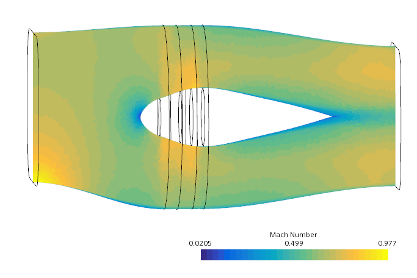
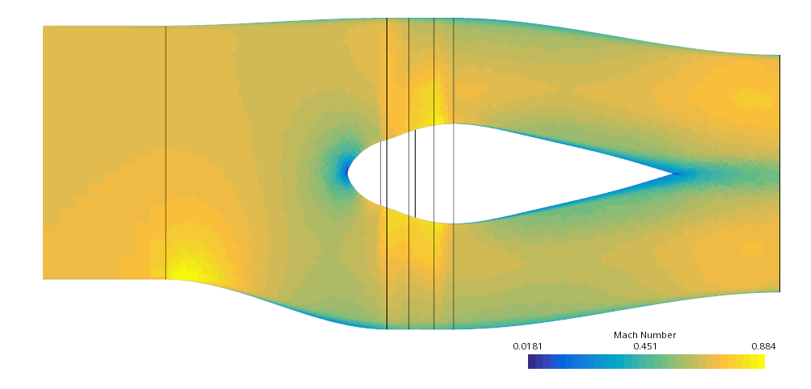
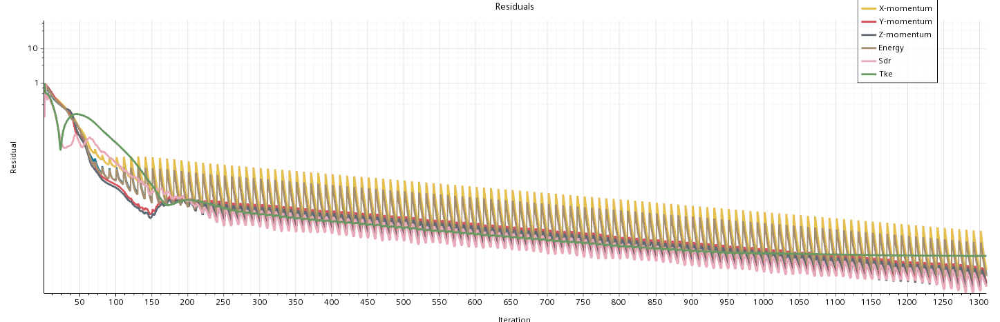
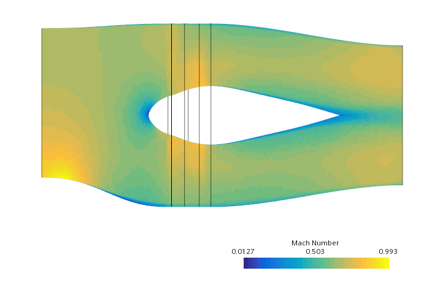
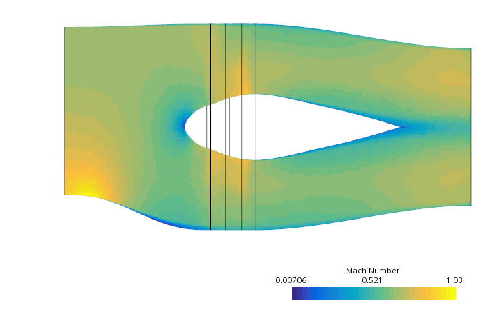
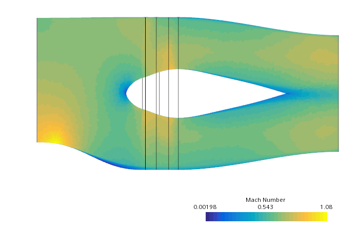
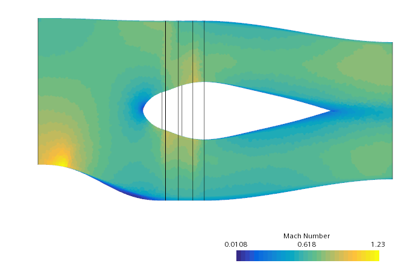
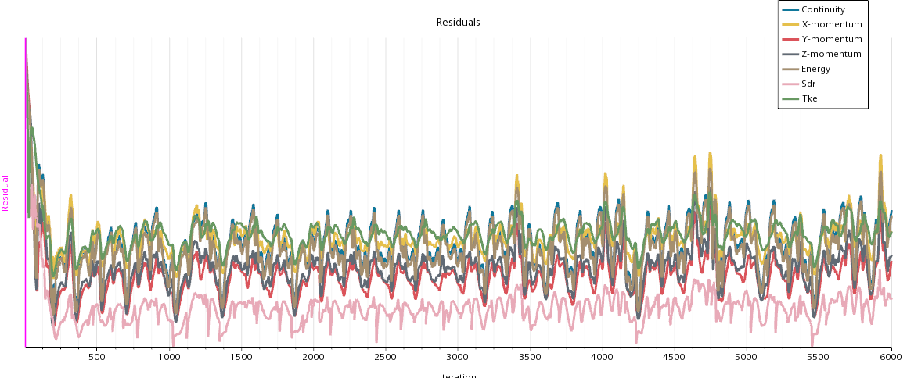

# Problem 
After replace part to offset 0.2, in single_propulsor, the simulation stops to converge

```
WARNING: insufficient precision on multigrid level 12, nRows = 2
         AMG coarsening halted.
A floating point error has occurred. The following error has been logged:
  A non-finite residual (Continuity) was added. Typical causes are overflow, underflow, or a division by zero.
Please check your usage and inputs.
Command: RunSimulation
   error: Server Error
```

# Remarks
- Offset 0.1 works fine
- Replacing part back to 0.1, converges
- Making a better mesh makes simulation run a litte further (other than crashing at the first iteration)
- Can converge up to zmot_ratio of 0.15, but not 0.16.
- Possible problem is the supersonic region at the inlet (bottom). In the image zmot_ratio = 0.15



# Adding prism
- Adding an extrusion allows convergence (non-slip wall, but no BL mesh...).
	- It only converged when I changed the monitor from the old inlet to the new inlet. When the monitor (max Mach) was at the "old" inlet, I got the "typical" error.
(image for zmot_ratio=.16)



# Changing geometry (zmot_ratio=0.16, d2f0=0.0)
- Trying with imposing d2f0=0.0 at the profile that is used to create the duct.
- No prism added.
- First attempt with zmot_ratio=0.16 (the first that crashes, after 0.15)

- This moves the high velocity region downstream and away from the inlet.

# Changing geometry (zmot_ratio=0.17, d2f0=0.0)
- Simulation converges.

- We have a supersonic flow region (but away from the inlet)

# Changing geometry (zmot_ratio=0.18, d2f0=0.0)
- Simulation converges.

- We have the same supersonic flow region with higher values of M.

# Changing geometry (zmot_ratio=0.20, d2f0=0.0)
- Simulation does not converge well. (but no crash)
	- Must do some mesh refinement, due to shock



# Take outs
- Use **Max Tet Size** to limit cell size in volume mesh.
- Having localized supersonic flow very close to the inlet ("edge") creates error
- Should initialize solution with slower flow velocity (200m/s may be too much) and let solver increase it gradually.
- **The supesonic region near the inlet causes a crash because the static supersonic pressure was not well defined at the inlet**