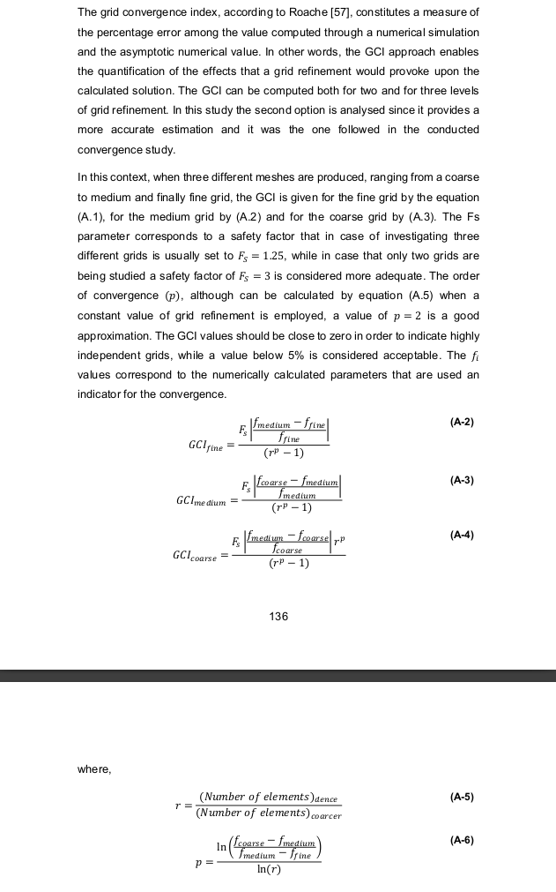

# Grid Convergence
The Grid Convergence Index (GCI) constitutes a measure of the percentage error among the values computed through a numerical simulation and the asymptotic numerical value. It allows the quantification of the effects of refining the grind upon the converged solution and can be computed for two or three levels of grid refinement. 

The definition of GCI, for a given level of refinement $i$ is given by
$$
CGI_i = 
\frac{k \left| \dfrac{f_{i-1} - f_i}{f_i} \right|}{r^p - 1},
$$
where $k$ is a safety factor, $r$ is given by, for the case of three levels of refinement,
$$
r = \frac{N_3}{N_{0}},
$$
and the order of convergence, $p$, by
$$
p = \frac{\ln\left(\dfrac{f_0-f_1}{f_1-f_2}\right)}{\ln r}.
$$

## Richardson extrapolation

(adapted from https://www.grc.nasa.gov/www/wind/valid/tutorial/spatconv.html)

Richardson extrapolation is a method for obtaining higher-order stiamte of the continuum value (value at zero grid spacing) from a series of lower-order discrete values.

A simulation will yield a quantity $f$ that can be expressed in a general form by the series expansion

$$
f = f_{h=0} +  g_1 h +  g_2  h^2 +  g_3  h^3 + \ldots \, ,
$$

where $h$ is the grid spacing and the functions $g_i$ are independent of the grid spacing. The quantity $f$ is considered *second order* if $g_1 = 0.0$. The term $f_{h=0}$ is the continuum value at zero grid spacing.

If one assumes a second-order solution and has computed $f$ on two grids of spacing $h_1$ and $h_2$, with $h_1$ being the finer spacing, then one can write two equations for the above expansion, negleting *third-order* and higher terms, and solve for $f_{h=0}$ to estimate the continuum value, 

$$
f_{h=0} \approx f_1 + \dfrac{f_1-f_2}{r^p - 1}
$$