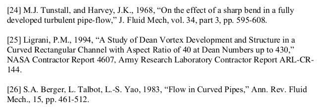
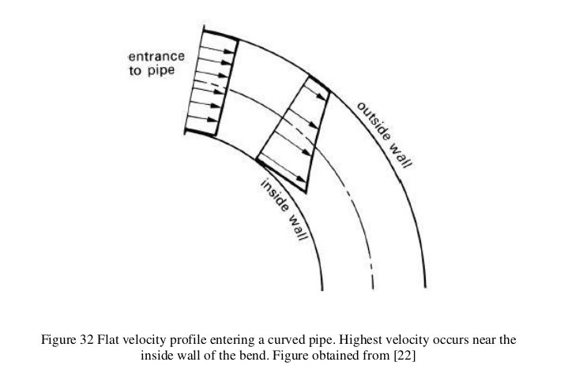
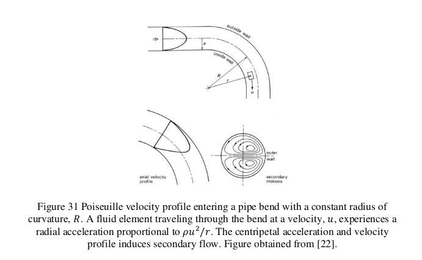
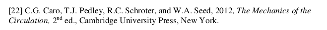

# Literature
Taken from J. Branson Thesis (2022)

# Flow in curved pipes
*Adapted text from J. Branson*

The flow effects of pipe curvature are important in the secondary flow behavior that is common in an s-duct. The curved pipe intrudices addicitonal effect of centripetal acceleration on the fluid, due to the existence of a transverse pressure gratient.

# Dean Number

The Dean number $K$, defu