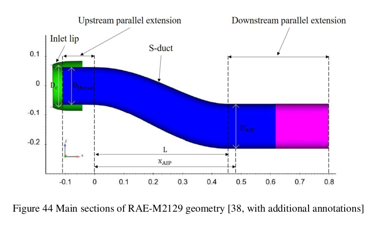
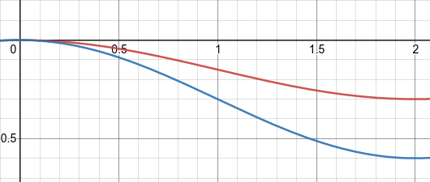
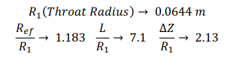
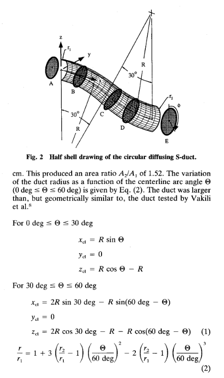
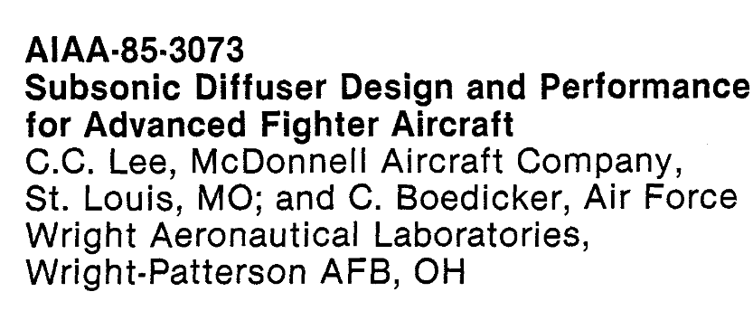

# RAE-M2129

## Used By
- Asghard
	- Different inlet (rectangular with rounded corners)
- Chiang
	- Different inlet (rectangular with rounded corners)
	- O/D = 1.0
- Brandon

	| Quantity  | Value | Description |
	| :-: | :-: | -|
	| D_throat  | 0.1288 m  | Throat diameter|
	| D_c  | 0.1440 m  | Highlight (entry) diameter, capture area|
	| D_AIP  | 0.1524 m  | Diameter at AIP|
	| x_AIP  | 0.4839 m  | AIP position|
	| L  | 0.4572 m  | Duct Length|
	| $\Delta Z$  | -0.15 m  | Offset|

- *Application of CFD to High Offset Intake Diffusers*
- Berens *et al* in *Numerical Simulations for High Offset Intake Diffuser Flows*

## Definitions

> **From Jacob A Brandon Masther Thesis**
> The geometry of the RAE-M2129 is defined by the following centerline equation (at $y=0$), cross-sectional diameter equation, and table below:

$$
z = -0.15 \left[1 - \cos\left(\frac{\pi x}{L}\right)\right]
$$

$$
D  = D_\text{throat} 
+ \left(D_\text{AIP}-D_\text{throat}\right)
\left[3 \left(1-\frac{x}{L}\right)^4 - 4 \left(1-\frac{x}{L}\right)^3 + 1\right]
$$

**However, in *CFD Validation and Flow Control of RAE-M2129 S-Duct Diffuser Using CREATETM-AV Kestrel Simulation Tools*, the definitions are slightly different:**

$$
z = 0.15 L \left[1 - \cos\left(\pi \frac{x}{L}\right)\right]
$$

**For L=2, we see that the curves are not the same!**

The radial distribution is 
$$
\left(\frac{R-R_t}{R_f-R_t}\right) = 
3 \left(1-\frac{x}{L}\right)^4 - 4 \left(1-\frac{x}{L}\right)^3 + 1\, ,
$$
where $L$ is the diffuser length, $R_t$ and $R_f$ are the throat and engine face radii,r espectively.
This is the same as the previous.

**But, from *Investigation of RAE-M2129 S-Shaped Intake with Computational Fluid Dynamics*, we have**

$$
Z = -\Delta Z \left[1 - \cos\left(\pi \frac{x}{L}\right)\right]
$$

# Wellborn (??)

## Used by
- Wellborn *et al* in *Study of the Compressible Flow in a Diffusing S-Duct*
- d'Ambros *et al* in *Computational Design Optimization for S-Ducts*

## Definitions

The centerline is given, for $0\le \theta < \theta_\text{max}/2$, by
$$
\begin{align*}
x &= R \sin(\theta), \\
y &= 0, \\
z &= R \cos (\theta) - R,
\end{align*}
$$
and, for $\theta_\text{max}/2 \le \theta \le \theta_\text{max}$, by
$$
\begin{align*}
x &= 2R \sin(\theta/2) - R \sin(\theta_\text{max} - \theta), \\
y &= 0, \\
z &= 2R \cos(\theta/2) - R \cos(\theta_\text{max} - \theta) - R.
\end{align*}
$$
The radial distribution is given by
$$
\frac{r}{r_1} = 
1 
+ 3 \left(\frac{r_2}{r_1} - 1\right) \left(\frac{\theta}{\theta_\text{max}}\right)^2
- 2 \left(\frac{r_2}{r_1} - 1\right) \left(\frac{\theta}{\theta_\text{max}}\right)^3.
$$

Wellington specifies $\theta_\text{max} = 60 \deg$.

# Other

