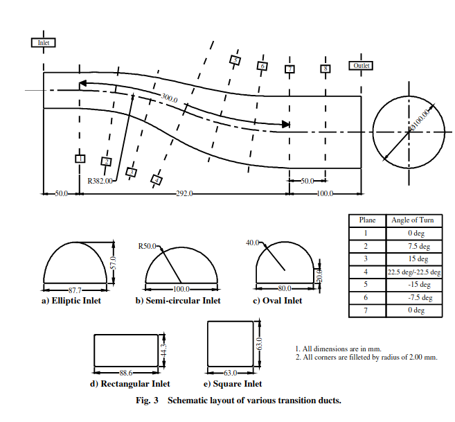
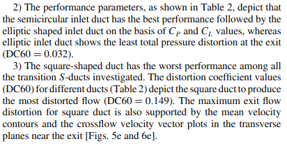
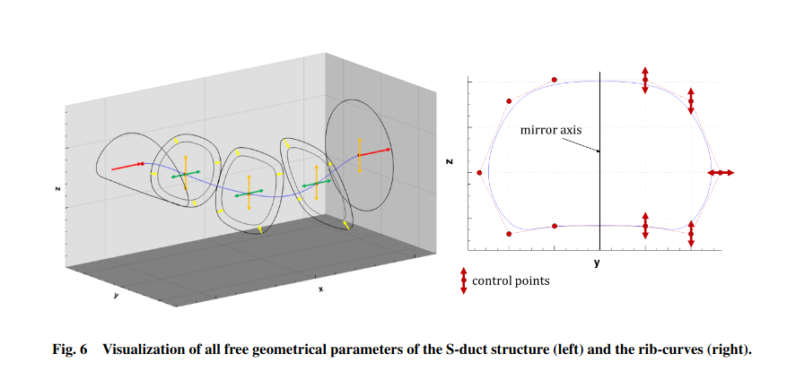
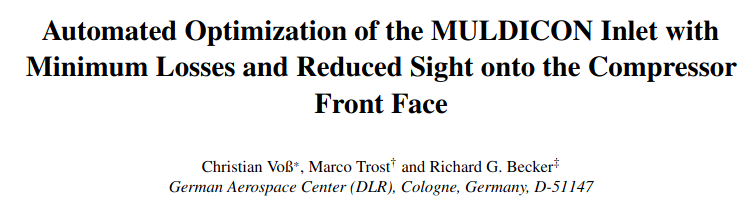

Multiple types of s-ducts:
- Rectangular to circular
- Semi-circular to circular
- Rectangular to circular

# The Aerodynamic Interface Plane

# Paper: Computational Analysis on Flow Through Transition s-Diffusers: Effect of Inlet Shape

# Paper: Automated Optimization of the MULDICON INlet with Minimum Losses and Reduced Sight onto the Compressore Front Face

- Uses the spine-sections parameterization technique.

