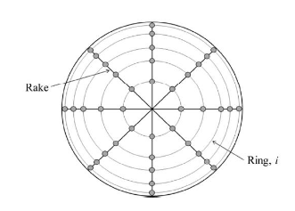
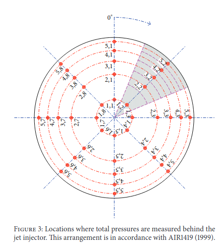
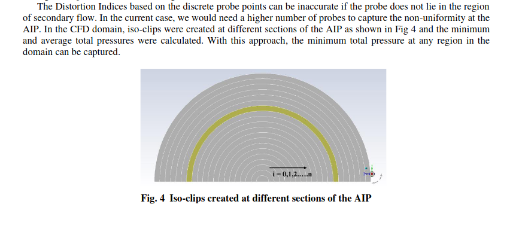
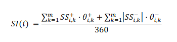
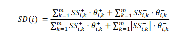
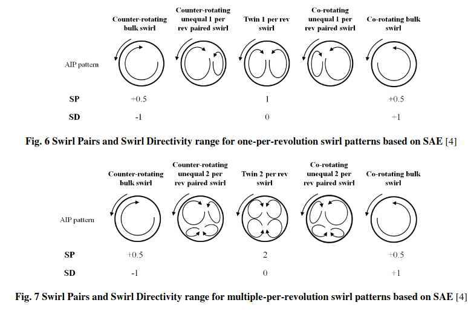
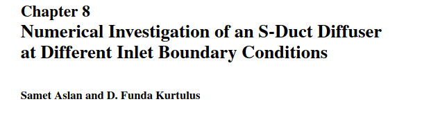
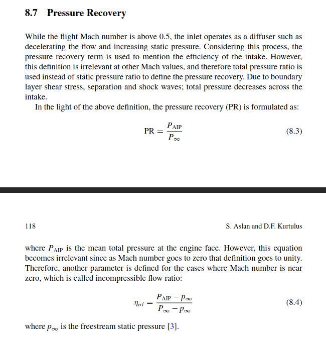

# Distortion Index
There are methods to measure/quantify the uniformity of the flow at an Aerodynamic Interest Plane (AIP). The standard masurement arrangement for engine intages at the AIP consists on a 8 x 5 "ring and rake" setup (8 spokes and 5 rings).

The rings are distributed so that each crown as the same area, and pressure probes are located at the intersection between the rings and spokes.

From the measurements of this setup, it is possible to assess the uniformity of the circumferential total pressure distribution and quantify it with the Cirfumferential Distortion Index (CDI), defined as 
$$
CDI = \max_{i=1}^{n_r-1}\left(
\frac{1}{2}
\left[
\frac{{p_{0,\text{avg}}}_i-{p_{0,\min}}_i}{p_{0, \text{avg}}}
+
\frac{{p_{0,\text{avg}}}_{i+1}-{p_{0,\min}}_{i+1}}{p_{0, \text{avg}}}
\right]
\right),
$$
or, if obtained from averages on the crowns instead of the rings, as
$$
CDI = \max_{i=1}^{n_c}\left(
\frac{1}{2}
\left[
\frac{{p_{0,\text{avg}}}_i-{p_{0,\min}}_i}{p_{0, \text{avg}}}
\right]
\right)
$$

According to [@kamat_flow_2020](http://dx.doi.org/10.2514%2F6.2020-2755). But more can be used...

> The Distortion Indices based on the discrete probe points can be inaccurate if the probe does not lie in the region of secondary flow. In the current case, we would need a higher number of probes to capture the non-uniformity at the AIP. In the CFD domain, iso-clips were created at different sections of the AIP as shown in Fig 4 and the minimum and  average  total  pressures  were  calculated.  With  this  approach,  the  minimum  total pressure  at  any  region  in  the domain can be captured. 

The Radial Distortion Index (RDI) is, similarlly, computed as
$$
RDI = \max
\left(
\frac{{p_{0,\text{avg}}}-{p_{0,\min}}}{p_{0, \text{avg}}}
,
\frac{{p_{0,\text{avg}}}-{p_{0,\min}}}{p_{0, \text{avg}}}
\right)
$$

# Swirl Intensity
Swirl intensity (SI) calculates the average absolute swirl angle on a given ring. It can be define as

The Swirl Directivity (SD) represents the overall sence of rotation of the swirling flow in that ring. 

(from DOI:10.2514/1.J055354 Passive flow control study in an S-duct intake using Stereo 
Particle Image Velocimetry)
[@tanguy_passive_2017](http://dx.doi.org/10.2514%2F1.J055354)

# Total pressure recovery
$$
PR = \frac{p_{0, \text{outlet}}}{p_{0, \text{inlet}}}
$$

