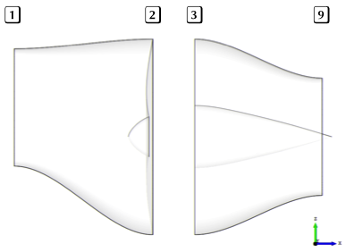

For the case of a single duct with fan (with, or without BFM), the imposed boundary conditions are Stagnation Inlet at station 1 and Pressure Outlet (or just Outlet) at station 9.

We have a prescribed Mach number $M_2$ at the fan face, that comes from the fan design, and an operating massflow also provided from the fan design.

The inlet area is computed such that the massflow of the inlet and outlet of the duct are the same, given that the selected pressure loss is correct. The area ration between the two sections of the duct is given by
$$
\frac{A_1}{A_2} = 
\sqrt{\frac{T_{t1}}{T_{t2}}}
\frac{\varpi_2}{\varpi_1}
\frac{p_{t2}}{p_{t1}}
=
\sqrt{\frac{T_{t1}}{T_{t2}}}
\frac{\varpi_2}{\varpi_1}
k \, ,
$$
where $\varpi$ is the reduced mass flow, defined as
$$
\varpi = \frac{\dot{m} \sqrt{T_t}}{p_t A} = \sqrt{\frac{\gamma}{R}} M \left(1+  \frac{\gamma-1}{2} M_1^2\right)^{-\frac{\gamma + 1}{2(\gamma - 1)}}.
$$
$R = 287.04$ is the specific gas constant and $\gamma = 1.4$ is the heat capacity ratio.

Total pressure and temperature are defined from the freestream static quantities and Mach number as
$$
p_{t1} = p_1 \left(1+  \frac{\gamma-1}{2} M_1^2\right)^{\frac{\gamma}{\gamma - 1}},  \quad
T_{t1} = T_1 \left(1+  \frac{\gamma-1}{2} M_1^2\right).
$$

Inlet mass flow $\dot{m}_1$ is obtained from 
$$
\dot{m}_1 = p_1 (T_1 R)^{-1} A_1 M_1\sqrt{\gamma R T_1}.
$$

Assuming pressures losses along the duct, from 1 to 2, represented by $k = p_{t2}/p_{t}$, the static pressure and temperature at 2 can be obtained from
$$
p_{2} = k p_{t1} \left(1+  \frac{\gamma-1}{2} M_2^2\right)^{-\frac{\gamma}{\gamma-1} }, \quad
T_{2} = T_{t1} \left(1+  \frac{\gamma-1}{2} M_2^2\right)^{-1}.
$$

Duct outlet mass flow $\dot{m}_2$ is obtained from 
$$
\dot{m}_2 = p_2 (T_2 R)^{-1} A_2 M_2\sqrt{\gamma R T_2}.
$$

# Initial design process

The fan design provides a specific massflow at which the fan is operating at the design point. At station (2) we have the following
$$\dot{m}_\text{red,2} =
\left[\frac{\dot{m} \sqrt{RT_{t2}}}{p_{t2}A_2}\right]_\text{design} = 
\sqrt{\gamma} M_2 \left(1 + \frac{\gamma - 1}{2} M_2^2\right)^{\frac{\gamma + 1}{2(\gamma -1)}}.
$$

As we want to have the same reduced mass flow $\dot{m}_\text{red,2}$, we can use the previous expression to determine $M_2$. This mach number, together with the pressure recovery at the duct, is used to obtain the duct aspect ratio, from the expression

$$
\frac{A_1}{A_2} = 
\sqrt{\frac{T_{t1}}{T_{t2}}}
\frac{\varpi_2}{\varpi_1}
\frac{p_{t2}}{p_{t1}}
=
\sqrt{\frac{T_{t1}}{T_{t2}}}
\frac{\varpi_2}{\varpi_1}
k \, ,
$$
where $\varpi$ is the reduced mass flow, defined as
$$
\varpi = \frac{\dot{m} \sqrt{T_t}}{p_t A} = \sqrt{\frac{\gamma}{R}} M \left(1+  \frac{\gamma-1}{2} M_1^2\right)^{-\frac{\gamma + 1}{2(\gamma - 1)}}.
$$
$R = 287.04$ is the specific gas constant and $\gamma = 1.4$ is the heat capacity ratio. The total temperature ratio is assumed to be 1.0. $M_1$ is assumed to be the flight mach number.

# Convergence loop

